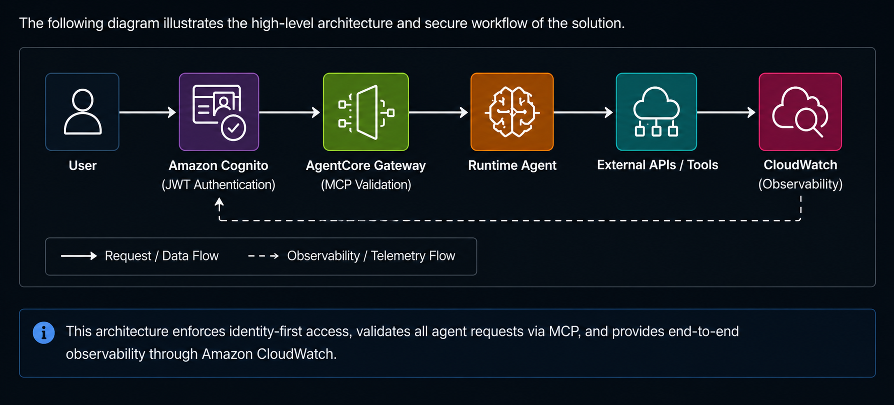

# Agentic AI Security Architecture (AWS Bedrock + MCP Integration)

This project demonstrates the design and implementation of a secure, cloud-native Agentic AI system using Amazon Bedrock AgentCore and Strands Agents.

It focuses on enforcing identity-driven access control, secure agent-to-tool communication (via MCP), and end-to-end observability for AI-driven workflows.

## 🔍 Project Origin & Evolution
This project began as a hands-on laboratory implementation developed during the BeSA Cloud Academy “Agentic AI on AWS” programme. I independently evolved the baseline into a security-focused, cloud-deployed reference architecture, introducing Zero Trust principles, Amazon Cognito JWT authentication, secure Model Context Protocol (MCP) integration, least-privilege IAM controls, CloudWatch observability, and production-oriented deployment patterns, with the resulting architecture validated through live runtime execution.

## 🖥️ Lab Environment & Requirements
Executed on a secure AWS EC2 instance (us-west-2) with least-privilege IAM roles.

**Requirements**
- Amazon Bedrock access
- Cognito User Pool for authentication
- Docker, AWS CLI, Python 3.11+

## 🧩 Project Architecture & Workflow

The deployment demonstrates how the agent is containerised, packaged, and deployed as a managed runtime through Amazon Bedrock AgentCore.

## 🧩 Solution Architecture

This diagram summarises the secure request flow implemented by the solution, from identity verification and MCP validation through runtime execution and end-to-end observability.

## 🏗️ Architectural Design Decisions
The architecture was designed around explicit security and operational requirements for a production-oriented Agentic AI system. Key design decisions include:

- **Identity & Authentication:** **Amazon Cognito** was selected to provide standards-based JWT authentication and eliminate hard-coded credentials.
- **Protocol Governance:** **Amazon Bedrock AgentCore Gateway** was used to enforce authenticated and controlled agent-to-tool communication through the Model Context Protocol (MCP).
- **Trust Model:** Least-privilege **IAM roles** were implemented across system components to support a Zero Trust security model.
- **Runtime Observability:** **CloudWatch Observability** was configured to provide runtime monitoring, execution tracing, and operational visibility.
- **Containerised Deployment:** **Docker** was adopted to support consistent and reproducible deployment of the solution.

These decisions prioritise secure identity, controlled access, end-to-end observability, and operational resilience for cloud-native Agentic AI systems.

## Security Principles
The implementation is guided by the following security principles:
- Zero Trust architecture
- Identity-first authentication
- Least-privilege access control
- Secure agent-to-tool communication
- End-to-end observability
- Elimination of embedded credentials
- Defence in depth

## 🔐 Security Architecture Highlights
- Implemented Zero Trust access control using AWS Cognito (JWT-based authentication)  
- Secured agent-to-tool communication using Model Context Protocol (MCP)  
- Enforced least-privilege IAM roles across all system components  
- Eliminated hard-coded secrets using managed identity and credential services  
- Protected external API access through AgentCore Gateway with controlled request validation

## ⚙️ System Capabilities
- Secure agent-to-tool interaction with structured and controlled execution  
- Real-time API integration through MCP-enabled tool invocation  
- End-to-end observability with CloudWatch for tracing and monitoring agent workflows  
- Scalable deployment using Docker, Amazon ECR, and AWS CodeBuild  
- Modular architecture supporting extensible AI agent workflows

## 🧠 Design Considerations
- **Zero Trust:** Applied explicit identity and least-privilege controls across distributed agent workflows.
- **Identity-First Access:** Prioritized authenticated, token-based access over static credential usage.
- **Modular Security Boundaries:** Separated agent execution, tool invocation, authentication, and observability components to support controlled integration.
- **Operational Visibility:** Designed for runtime telemetry and traceability of agent-driven actions.

## Threat Model
The implementation was designed to address security risks arising from authenticated agent execution, agent-to-tool communication, credential handling, and cloud resource access.

**Primary threats considered:**

- Unauthorized agent-to-tool invocation
- Unauthenticated or improperly authenticated requests
- Credential and secret exposure
- Excessive IAM permissions
- Uncontrolled external API/tool access
- Insufficient runtime visibility and auditability
- Token misuse within authenticated request flows

**Corresponding security controls include:**

- JWT authentication via Amazon Cognito
- Least-privilege IAM roles
- Managed credential and secret handling
- AgentCore Gateway / MCP request validation
- Controlled agent-to-tool communication
- CloudWatch runtime observability and telemetry

## Current Limitations
This implementation is intended as a production-oriented security reference architecture rather than a complete enterprise deployment.
Current limitations include:
- Single-region deployment
- No human-in-the-loop approval workflow
- Limited AI guardrails and prompt filtering
- No policy-based authorization engine
- No automated security testing within the CI/CD pipeline

These limitations define clear areas for future enhancement while keeping the implementation focused on core security architecture and control validation.

## Future Enhancements
Planned enhancements include:
- Amazon Bedrock Guardrails integration
- Human-in-the-loop approval workflows
- Policy-based authorization using Open Policy Agent (OPA)
- AI red-team testing
- Automated security testing within CI/CD pipelines

These enhancements would extend the reference architecture toward stronger governance, policy enforcement, adversarial validation, and enterprise-scale deployment.

## 🛠️ Implementation Overview
- **Developed** Strands Agents integrated with Amazon Bedrock models and custom tools.
- **Implemented** managed identity and credential handling using AgentCore Identity.
- **Enforced** JWT-based authentication through Amazon Cognito for controlled gateway access.
- **Established** structured agent-to-tool communication using MCP with OpenAPI-integrated tools.
- **Containerized and deployed** the solution using Docker, Amazon ECR, and AWS CodeBuild.
- **Configured** Amazon CloudWatch observability for runtime monitoring, telemetry, and execution tracing.

## ⚡ Key Features
- **Identity-first API access** using JWT authentication.
- **Controlled MCP tool invocation** through AgentCore Gateway.
- **OpenAPI-to-MCP integration** for structured external tool access.
- **Managed identity and credential handling** without embedded application secrets.
- **Runtime telemetry and session tracing** through CloudWatch.

## 📊 Outcomes & Results
- **Successfully deployed** an Agentic AI workflow with authenticated external API/tool integration.
- **Validated end-to-end request execution** from authenticated client access through agent runtime and tool invocation.
- **Verified runtime observability** through CloudWatch telemetry and execution monitoring.
- **Demonstrated controlled agent-to-tool communication** through MCP and AgentCore Gateway.
- **Demonstrated a reusable security architecture** combining identity, least-privilege access, controlled tool invocation, and runtime observability.

## 🔧 Technologies & Tools
- **Agentic AI:** Strands Agents, Amazon Bedrock
- **AgentCore:** Runtime, Gateway, Identity
- **Security:** Amazon Cognito, IAM, JWT, MCP
- **Integration:** OpenAPI, external APIs/tools
- **Deployment:** Docker, Amazon ECR, AWS CodeBuild
- **Observability:** Amazon CloudWatch

## 📸 Implementation Evidence
### 1. Secure Credentials with AgentCore Identity

### 2. Cognito JWT Token Generation

Execution cell and runtime logs demonstrating secure JWT token generation without embedded application credentials.

### 3. AgentCore Gateway with OpenAPI MCP

### 4. CloudWatch Observability Dashboard

Runtime Validation: CloudWatch recorded 124 traces across 2 sessions, with 0% errors and 0% throttling, confirming successful runtime execution.

## Related Component
This system includes secure agent-to-tool communication implemented using the Model Context Protocol (MCP), integrating the deployed AgentCore Gateway with external API capabilities.

**See implementation:**
https://github.com/CliffordEdewor/secure-mcp-agent-integration.git

## 📚 Use Case
This project demonstrates applied security engineering for production-oriented Agentic AI architectures, combining authenticated API access, secure agent-to-tool communication, and cloud-native runtime controls. The security patterns are applicable to enterprise, hybrid IT/OT, and critical-infrastructure environments.

## 📄 License
This project is provided for demonstration and portfolio purposes, showcasing applied implementation of secure Agentic AI systems.
