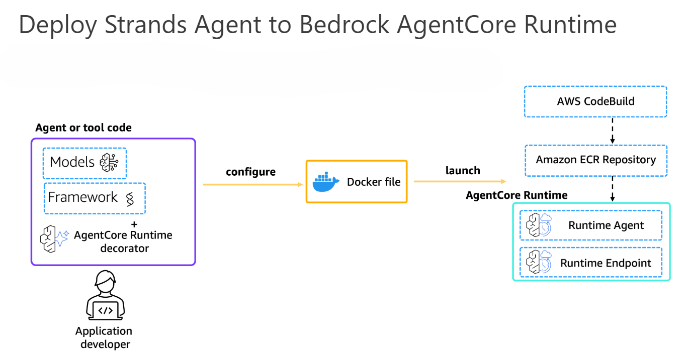
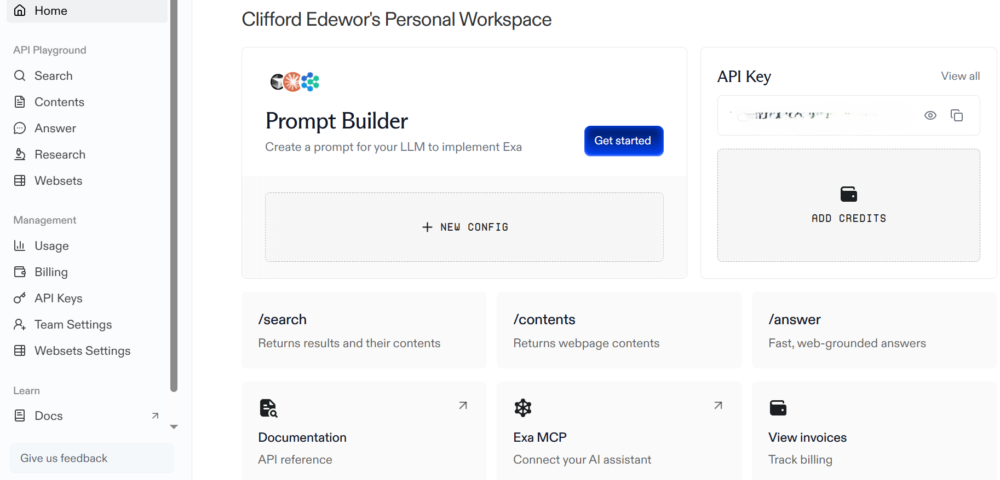
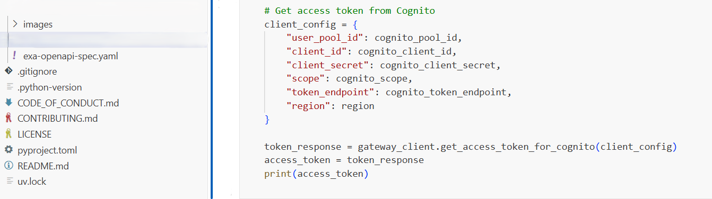
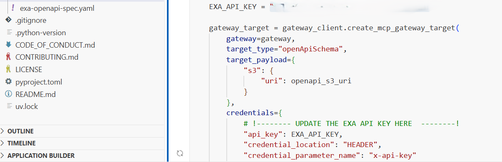
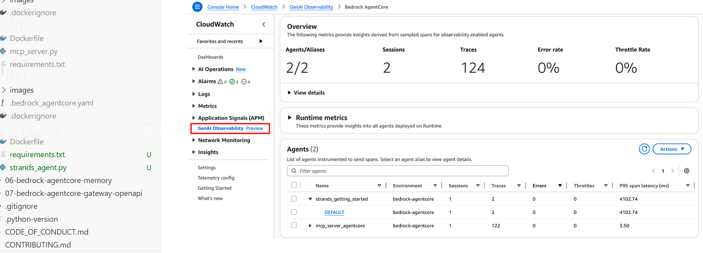

# Agentic AI Security Architecture (AWS Bedrock + MCP Integration)

This project demonstrates the design and implementation of a secure, cloud-native Agentic AI system using Amazon Bedrock AgentCore and Strands Agents.

It focuses on enforcing identity-driven access control, secure agent-to-tool communication (via MCP), and end-to-end observability for AI-driven workflows.

## Project Origin
This project originated from hands-on laboratories completed during the BeSA Cloud Academy "Agentic AI on AWS" programme. It has since been independently extended into a security-focused reference implementation incorporating Zero Trust principles, Amazon Cognito JWT authentication, secure Model Context Protocol (MCP) integration, CloudWatch observability, least-privilege IAM controls, and production-oriented deployment patterns.

## 🖥️ Lab Environment & Requirements
Executed on a secure AWS EC2 instance (us-west-2) with least-privilege IAM roles.

**Requirements**
- Amazon Bedrock access
- Cognito User Pool for authentication
- Docker, AWS CLI, Python 3.11+

## 🧩 Project Architecture & Workflow

This deployment illustrates how the solution is packaged and deployed
using Amazon Bedrock AgentCore Runtime.

---

### High-Level Security Architecture

[Project-solution-architecture](images/Project-solution-architecture.png)

This diagram summarises the secure request flow implemented by the solution,
from identity verification through runtime execution and observability.

## Architecture Decisions
The architecture was designed to demonstrate secure deployment patterns for production-oriented Agentic AI systems.
Key design decisions include:
- **Amazon Cognito** was selected to provide standards-based JWT authentication and eliminate hard-coded credentials.
- **Amazon Bedrock AgentCore Gateway** was used to enforce authenticated and controlled agent-to-tool communication through the Model Context Protocol (MCP).
- **Least-privilege IAM roles** were implemented across all components to support a Zero Trust security model.
- **CloudWatch Observability** was configured to provide runtime monitoring, execution tracing, and operational visibility.
- **Docker** was adopted to enable consistent deployment across cloud environments.
These decisions prioritise secure identity, controlled access, observability, and operational resilience for cloud-native Agentic AI systems.

## Security Principles
The implementation is guided by the following security principles:
- Zero Trust architecture
- Identity-first authentication
- Least-privilege access control
- Secure agent-to-tool communication
- End-to-end observability
- Elimination of embedded credentials
- Defence in depth

## 🔐 Security Architecture Highlights
- Implemented Zero Trust access control using AWS Cognito (JWT-based authentication)  
- Secured agent-to-tool communication using Model Context Protocol (MCP)  
- Enforced least-privilege IAM roles across all system components  
- Eliminated hard-coded secrets using managed identity and credential services  
- Protected API access through AgentCore Gateway with controlled request validation

## ⚙️ System Capabilities
- Secure agent-to-tool interaction with structured and controlled execution  
- Real-time API integration through MCP-enabled tool invocation  
- End-to-end observability with CloudWatch for tracing and monitoring agent workflows  
- Scalable deployment using Docker, Amazon ECR, and AWS CodeBuild  
- Modular architecture supporting extensible AI agent workflows

## 🧠 Design Considerations
- Designed with a Zero Trust security model across distributed agent workflows  
- Prioritized identity-driven access control over static credential usage  
- Ensured modular architecture to support extensibility and integration  
- Focused on observability to enable auditability of AI-driven actions

## Threat Model
This implementation was designed to mitigate common security risks in Agentic AI systems, including:
- Unauthorized agent-to-tool invocation
- Prompt injection attacks
- Credential leakage
- Hard-coded secret exposure
- Excessive IAM privileges
- API abuse
- Token replay attacks

Security controls include:

- JWT authentication via Amazon Cognito
- Least-privilege IAM roles
- Secure credential management
- MCP Gateway validation
- CloudWatch observability

## Current Limitations
This implementation is intended as a production-oriented security reference architecture rather than a complete enterprise deployment.
Current limitations include:
- Single-region deployment
- No human-in-the-loop approval workflow
- Limited AI guardrails and prompt filtering
- No policy-based authorization engine
- No automated security testing within the CI/CD pipeline

These limitations provide opportunities for future enhancement while keeping the implementation focused on core security design principles.

## Future Enhancements
Planned enhancements include:
- Amazon Bedrock Guardrails integration
- Human-in-the-loop approval workflows
- Policy-based authorization using Open Policy Agent (OPA)
- AI Red Team testing
- Automated security testing within CI/CD pipelines

These enhancements will further strengthen the architecture for enterprise-scale Agentic AI deployments.

## 🛠️ Implementation Overview
- Developed Strands Agents integrated with Amazon Bedrock models and custom tools  
- Implemented secure identity and credential management using AgentCore Identity  
- Enforced JWT-based authentication via AWS Cognito for controlled gateway access  
- Enabled structured agent-tool communication using MCP with OpenAPI integration  
- Deployed system using Docker, Amazon ECR, and AWS CodeBuild  
- Configured CloudWatch for real-time observability and monitoring  

## ⚡ Key Features
- Secure JWT-based API gateway integration
- Zero-code MCP tool generation from OpenAPI
- Production-ready credential management
- Full session tracing and observability

## 📊 Outcomes & Results
- Successfully deployed secure Agentic AI workflows with external API integration  
- Achieved end-to-end authentication with zero hard-coded secrets  
- Validated real-time agent execution with monitored and traceable interactions  
- Demonstrated secure architecture patterns applicable to cloud and critical infrastructure environments  

## 🔧 Technologies & Tools
- Strands Agents • Amazon Bedrock • Bedrock AgentCore (Identity, Browser, Runtime, Gateway)
- Cognito • OpenAPI • MCP • Docker • ECR • CodeBuild • CloudWatch GenAI

## 📸 Implementation Evidence
### 1. Secure Credentials with AgentCore Identity

### 2. Cognito JWT Token Generation

### 3. AgentCore Gateway with OpenAPI MCP

### 4. CloudWatch Observability Dashboard

## Related Component
This system includes secure agent-to-tool communication implemented using MCP.

See implementation:
https://github.com/CliffordEdewor/secure-mcp-agent-integration.git

## 📚 Use Case
This project demonstrates applied expertise in designing and securing production-grade Agentic AI systems in cloud-native environments, with capabilities directly applicable to protecting hybrid IT/OT infrastructures and critical national infrastructure.

## 📄 License
This project is provided for demonstration and portfolio purposes, showcasing applied implementation of secure Agentic AI systems.
